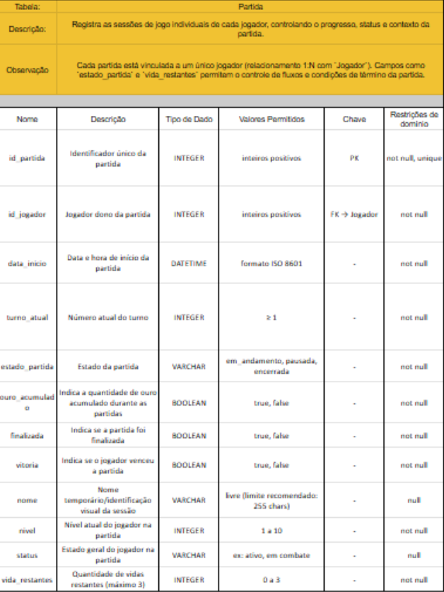
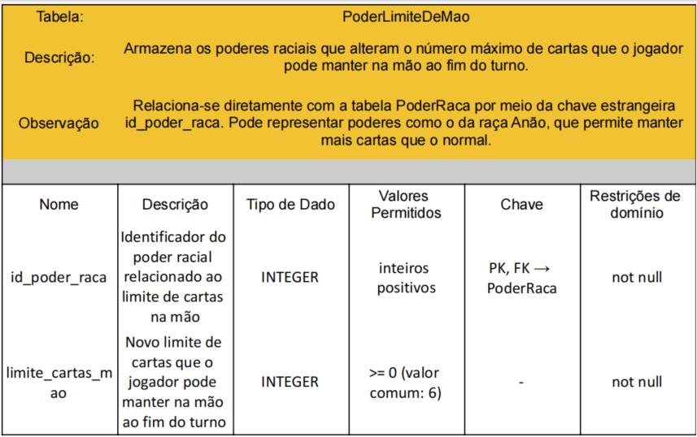
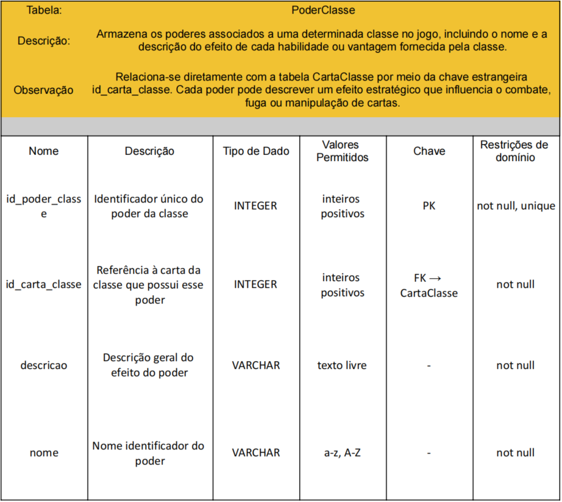
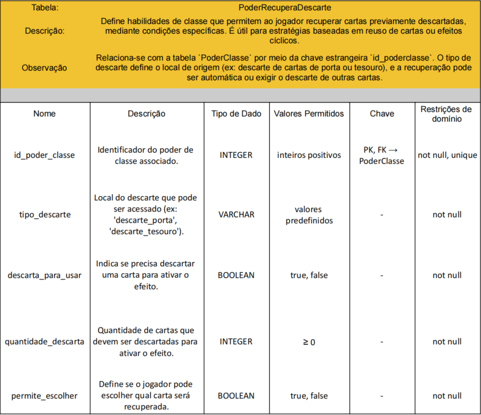
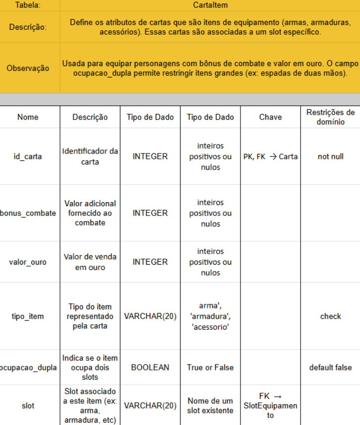
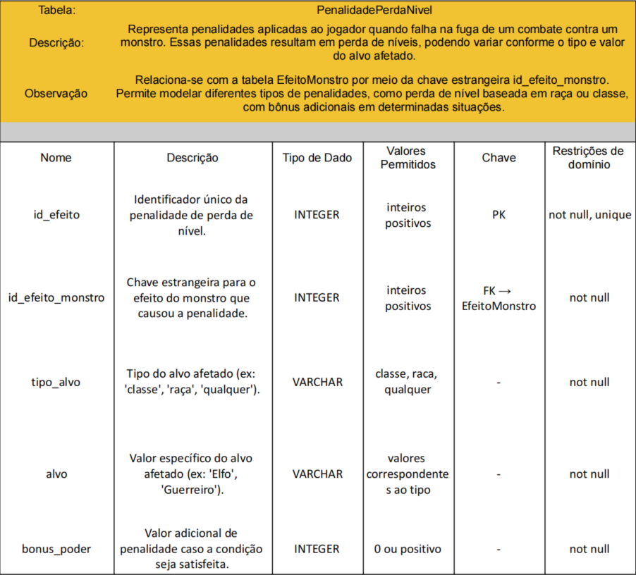
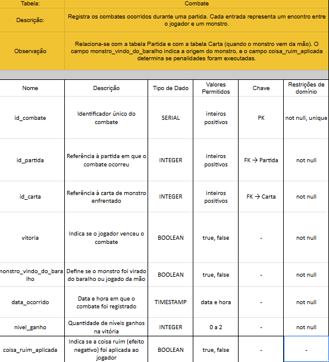

# Dicionário de Dados

## Introdução

O dicionário de dados descreve detalhadamente a estrutura do banco de dados do projeto, incluindo os nomes das tabelas, atributos, tipos de dados, valores permitidos, chaves primárias e estrangeiras, e restrições de domínio. Essa documentação é essencial para garantir consistência, integridade e clareza no desenvolvimento e manutenção do sistema.

## Objetivo

O objetivo deste dicionário é fornecer uma referência completa das tabelas utilizadas no banco de dados do jogo **Munchkin – Modo Solo**, com foco na definição dos campos, seus tipos e regras de negócio associadas, promovendo assim maior organização e entendimento técnico do modelo lógico.

## Estrutura

Para cada tabela serão apresentados:

- **Nome da Tabela**
- **Descrição**: Função principal da tabela no sistema.
- **Observações**: Regras adicionais ou dependências com outras tabelas.
- **Tabela de Campos**:
  - **Nome**: Nome do campo.
  - **Descrição**: Significado e uso do campo.
  - **Tipo de Dado**: Tipo armazenado (ex: INTEGER, VARCHAR, BOOLEAN, etc.).
  - **Valores Permitidos**: Enumerações ou intervalos aceitos.
  - **Chave**: Indicação se é PK (chave primária) ou FK (chave estrangeira).
  - **Restrições de Domínio**: Regras adicionais (ex: not null, unique, etc.).

---

A seguir, cada entidade será documentada em uma tabela com suas respectivas características.

## Tabelas e Relações

### Tabela: **Jogador**

### Tabela: **Partida**

### Tabela: **Carta**

### Tabela: **CartaPartida**

### Tabela: **CartaRaca**

### Tabela: **PoderRaca**

### Tabela: **PoderFugaCondicional**

### Tabela: **PoderMaldicao**

### Tabela: **PoderRecompensaCondicional**

### Tabela: **PoderLimiteDeMao**

### Tabela: **CartaClasse**

### Tabela: **PoderClasse**

### Tabela: **PoderCombate**

### Tabela: **PoderFuga**

### Tabela: **PoderFugaComBonus**

### Tabela: **PoderDescartaParaEfeito**

### Tabela: **PoderRecuperaDescarte**

### Tabela: **PoderEmpateVence**

### Tabela: **CartaItem**

### Tabela: **RestricaoItem**

### Tabela: **CartaMonstro**

### Tabela: **EfeitoMonstro**

### Tabela: **ModificadorContraAlvo**

### Tabela: **PenalidadePerdaNivel**

### Tabela: **PenalidadeItem**

### Tabela: **PenalidadeTransformacao**

### Tabela: **PenalidadeCondicional**

### Tabela: **Combate**

## Histórico de Versão

| Data       | Descrição                              | Autor                                                                 |
|------------|----------------------------------------|-----------------------------------------------------------------------|
| 25/04/2025 | Criação do artefato                    | [Breno Fernandes](https://github.com/Brenofrds)                      |
| 02/05/2025 | Colaboração na construção do dicionário de dados |[Breno Fernandes](https://github.com/Brenofrds),[Maria Clara Sena](https://github.com/mclarasena), [Ana Luiza](https://github.com/luluaroeira), [Mylena Mendonça](https://github.com/MylenaTrindade) |
